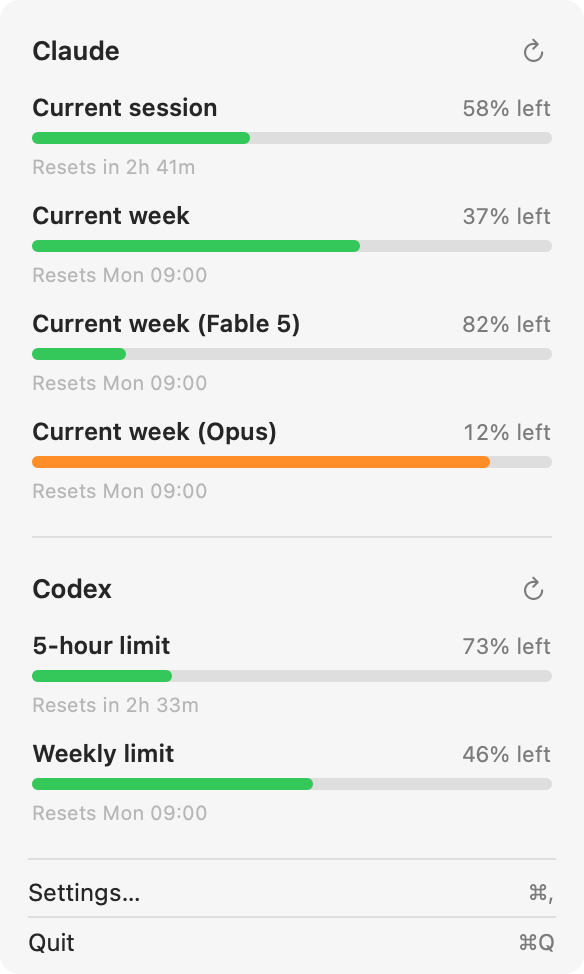

# Claude Usage

A macOS menu bar app showing how much Claude Code quota you have left.

## Collapsed

<picture>
  <source media="(prefers-color-scheme: dark)" srcset="docs/screenshots/menubar-dark.png">
  
</picture>

## Dropdown

<picture>
  <source media="(prefers-color-scheme: dark)" srcset="docs/screenshots/dropdown-dark.png">
  
</picture>

## Install

```sh
./build.sh
open ~/Applications/ClaudeUsage.app
./build.sh --no-install # Leaves ClaudeUsage.app in the repo instead
```

> On first launch macOS asks for permission to read the Claude Code credentials from your
Keychain. Choose **Always Allow**.

## Where the numbers come from

`GET https://api.anthropic.com/api/oauth/usage` — the same endpoint behind Claude Code's own
`/usage` command. The OAuth token is read from the Keychain item Claude Code stores under the
service `Claude Code-credentials`.

Response fields, all confirmed against the Claude Code binary:

| Field | Meaning |
| --- | --- |
| `five_hour` | current session window |
| `seven_day` | current week, all models |
| `limits[]` | per-model weekly windows — `kind: "weekly_scoped"`, `scope.model.display_name` |
| `seven_day_opus`, `seven_day_sonnet`, … | additional weekly windows when the plan has them |

`utilization` (and `limits[].percent`) is a percentage **0–100**; `resets_at` is **unix
seconds**; a window whose `utilization` is `null` is hidden rather than drawn as 0%.

## Rate limiting

This endpoint punishes eagerness, and the penalty **escalates**. Measured against the live
API: a first request answered `429` with `retry-after: 654`; after a burst of polling every
two minutes, a single request made following 15 minutes of complete silence still answered
`429`, now with `retry-after: 2023`. Requests made *during* a penalty extend it rather than
simply being refused. Claude Code itself caches a successful response for a full hour.

So the app is deliberately conservative:

- polls on a fixed interval (default 30 min, selectable 15/30/60 in the dropdown)
- never sends a request before a recorded `retry-after` has elapsed, plus a 60s margin so it
  cannot land on the boundary and re-trigger the penalty
- enforces a 15 minute floor between calls, so mashing Refresh cannot burn the budget
- refreshes on menu-open only if the data has aged past half the poll interval
- exponential backoff, capped at an hour, for network and 5xx errors
- keeps the last good payload in `~/Library/Application Support/ClaudeUsage/usage.json`
  so a restart paints immediately; anything older than an hour renders dimmed

If you ever see it stuck on "Rate limited", leave it alone — it is already waiting exactly as
long as the server asked, and poking it makes the wait longer.

## Token refresh

The access token expires roughly every 8 hours. The app refreshes it itself against
`https://platform.claude.com/v1/oauth/token` and writes the result back to the same Keychain
item, so the menu bar keeps working even if you have not opened Claude Code.

Refresh tokens rotate, and rotating one out from under a running Claude Code session would
break that session's next refresh. The app therefore does the least it can get away with:

1. refreshes only once the token is expired or within 2 minutes of it, never proactively
2. re-reads the Keychain under a lock first — if Claude Code already refreshed, that token is
   used and no rotation happens
3. merges into the existing JSON so `scopes` / `subscriptionType` / `rateLimitTier` survive
4. serialises with a cross-process `flock` so two copies cannot refresh at once

If refresh fails the last good numbers stay on screen, dimmed, with a note to run `claude`
once.

## Development

```sh
swift build -c release --product ClaudeUsage

# print resolved windows and exit — handy for checking against /usage
./.build/release/ClaudeUsage --dump

# drive the UI from a JSON file instead of the live endpoint
CLAUDE_USAGE_FIXTURE=/path/to/fixture.json ./.build/release/ClaudeUsage
```

| File | Role |
| --- | --- |
| `Keychain.swift` | reads/writes the `Claude Code-credentials` item |
| `Clock.swift` | "now", with a seam so screenshots can pin it |
| `OAuth.swift` | credential model, refresh flow, cross-process lock |
| `UsageAPI.swift` | endpoint call, decoding, 429/401 handling |
| `UsageModel.swift` | normalises the response into an ordered `[Bucket]` |
| `UsageStore.swift` | polling, backoff, disk cache, status |
| `GaugeRenderer.swift` | draws the menu bar image |
| `StatusItemController.swift` | `NSStatusItem` + popover wiring |
| `DropdownView.swift` | SwiftUI dropdown |
| `Screenshots.swift` | offscreen render of the README images |

## Screenshots

The images above are generated, never captured by hand, and refreshed by a pre-commit hook —
so a commit that changes the interface carries the matching images with it. Once per clone:

```sh
git config core.hooksPath .githooks
```

`.githooks/pre-commit` then re-renders and stages `docs/screenshots/` whenever the commit
touches `Sources/ClaudeUsage/*.swift`, `Package.swift` or `screenshots.sh`, and does nothing
at all otherwise — a README-only commit does not pay for a build. Bypass it with
`SKIP_SCREENSHOTS=1 git commit` or `git commit --no-verify`.

By hand, or from CI:

```sh
./screenshots.sh            # rewrite docs/screenshots/
./screenshots.sh --check    # fail if the committed PNGs are out of date
```

`--check` renders to a temp directory and diffs, so a UI change committed with the hook
bypassed shows up as a failure rather than as a quietly outdated README.

Under the hood it is `ClaudeUsage --screenshot <dir>`. The app puts the real `DropdownView` in
an `NSHostingView` inside an offscreen window and reads the layer back at 2×, so the picker,
the checkbox and the links are the actual controls rather than a mock-up, and the menu bar
chip comes from the same `GaugeRenderer` that draws the status item. Both are rendered twice,
once per appearance, and the README picks light or dark from `prefers-color-scheme`.

Output is byte-identical between runs — `git status` stays clean unless the UI actually
changed. Two things make that true:

- a fixture compiled into `Screenshots.swift` rather than live account data, so the numbers in
  the README are not anyone's real usage
- a pinned clock (`AppClock.fixedNow`) and a pinned `UTC` timezone, so "Resets in 2h 41m",
  "Resets Mon 09:00" and "Updated 14:27" are fixed strings instead of whatever the wall clock
  said at render time

It needs a window server, so run it on a logged-in Mac rather than over a bare SSH session; a
render that fails aborts the commit rather than letting a stale image through silently.
